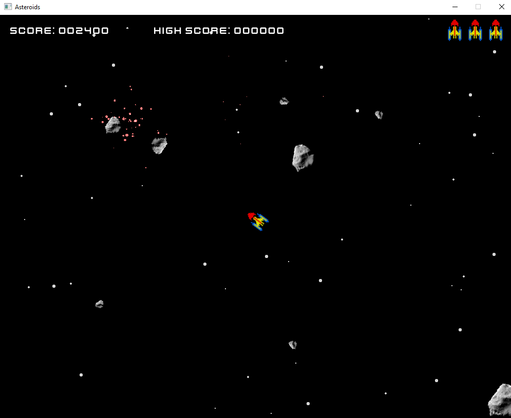
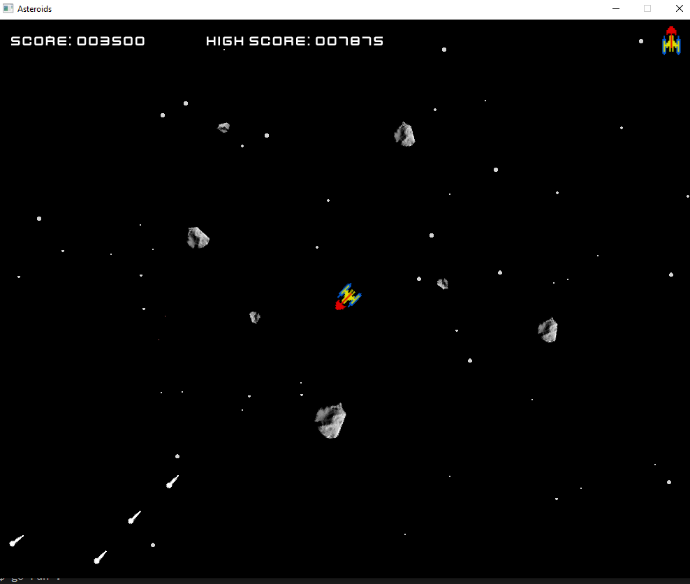
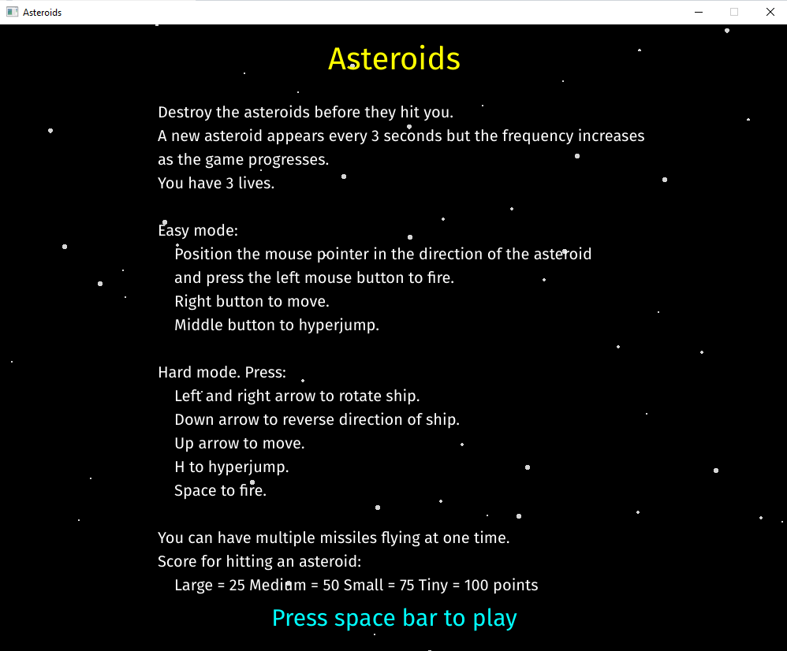

# Asteroids
 Classic Asteroids game written in Go using Ebitengine

I originally wrote this and 3 other retro games in JavaScript for my grandchildren.

If you are interested the site is here http://brace.great-site.net 

This version has been enhanced to allow ship movement and the larger asteroids 
split into smaller asteroids on being hit.

The game uses my Vector2 package which will need to be installed in your Go environment.

Please feel free to contact me regarding errors or suggestions for game or code improvement.

Author Paul Brace

paul.brace@gmail.com

July 2024